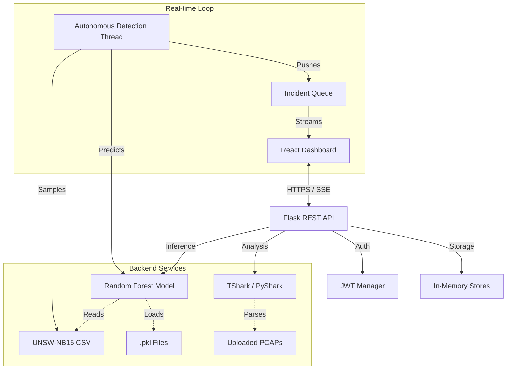

# Adminis Network Intrusion Detection System - Technical Documentation

## 1. Executive Summary
**Project Name**: Harth Security Platform
**Version**: 0.1.0 (Alpha)
**Date**: May 2025

The **Adminis Network Intrusion Detection System (IDS)** is a full-stack security platform designed to detect, analyze, and report network anomalies in real-time. It leverages a Machine Learning model (Random Forest) trained on the **UNSW-NB15** dataset to classify network traffic into categories such as DoS, Reconnaissance, Backdoor, and Fuzzers.

The system consists of:
1.  **React Frontend**: An interactive dashboard for visualizing threat metrics, geographical origins, and real-time logs.
2.  **Flask Backend**: A REST/SSE API handling auth, ML inference, and logs management.
3.  **Analysis Engine**: Utilities for deep inspection of PCAP/CSV network captures.

---

## 2. System Architecture

### 2.1 High-Level Diagram


### 2.2 Technology Stack
**Frontend**:
*   **Framework**: React 18
*   **UI Library**: Material UI (MUI v5)
*   **Visualization**: Nivo Charts, Chart.js, React-Leaflet
*   **State Management**: Redux Toolkit
*   **HTTP Client**: Axios

**Backend**:
*   **Framework**: Flask (Python 3.8+)
*   **ML Libraries**: Scikit-learn, Pandas, NumPy, Joblib
*   **Packet Analysis**: PyShark (TShark wrapper), GeoIP2 (MaxMind)
*   **Security**: PyJWT (HS256 encryption)

---

## 3. Installation & Configuration

### 3.1 Prerequisites
*   **Python**: 3.8 or higher
*   **Node.js**: 14.0.0 or higher
*   **Wireshark/TShark**: Must be installed and added to system PATH (required for PCAP analysis).

### 3.2 Backend Setup
1.  Navigate to the backend directory:
    ```bash
    cd network-intrusion/network-intrusion
    ```
2.  Create and activate a virtual environment (optional but recommended):
    ```bash
    python -m venv venv
    # Windows:
    .\venv\Scripts\activate
    # Linux/Mac:
    source venv/bin/activate
    ```
3.  Install dependencies:
    ```bash
    pip install flask flask-cors pandas scikit-learn pyshark geoip2 requests pyjwt joblib
    ```
4.  **Important**: Verify the `UNSW_NB15_training-set.csv` exists in the data path. If not, the system uses a mock dataset generator.

### 3.3 Frontend Setup
1.  Navigate to the frontend directory:
    ```bash
    cd network-intrusion/frontend
    ```
2.  Install packages:
    ```bash
    npm install
    ```
3.  Start the development server:
    ```bash
    npm start
    ```
    Access the dashboard at `http://localhost:3000`.

### 3.4 Environment Config
Create a `.env` file in `network-intrusion/network-intrusion/` (though currently hardcoded in `app.py`, these should be externalized):

| Variable | Description | Default |
|----------|-------------|---------|
| `FLASK_ENV` | Environment mode | `development` |
| `PORT` | Backend port | `8080` |
| `JWT_SECRET_KEY` | Secret for token signing | *Auto-generated* |
| `ALLOWED_ORIGINS` | CORS allowed hosts | `http://localhost:3000` |
| `UNSW_DATA_PATH` | Path to training CSV | `./data/UNSW_NB15...` |

---

## 4. Backend Services Deep-Dive

### 4.1 Authentication Service
*   **Type**: JWT (Bearer Token)
*   **Roles**:
    *   `admin`: Full access (Read/Write/Delete Users).
    *   `analyst`: Read/Write incidents and alerts.
    *   `viewer`: Read-only access.
*   **Storage**: In-memory `users_db` dictionary (Resets on restart).
*   **Default Users**:
    *   `admin` / `admin123`
    *   `analyst` / `analyst123`
    *   `viewer` / `viewer123`

### 4.2 Machine Learning Engine
*   **Algorithm**: Random Forest Classifier (`n_estimators=100`).
*   **Input Features**:
    1.  **Categorical**: `proto` (TCP/UDP), `service` (HTTP/DNS...), `state` (FIN/CON...).
    2.  **Numerical**: `dur` (duration), `sbytes`, `dbytes`, `sttl`, `dttl`, `sloss`, `dloss`, `sload`, `dload`, `spkts`, `dpkts`, etc.
*   **Performance Metrics** (Approx.):
    *   Accuracy: ~97.6%
    *   Precision: ~97.7%
    *   Recall: ~97.7%
*   **Encoders**: Uses `LabelEncoder` for categories and `StandardScaler` for normalization.

### 4.3 Autonomous Detection Simulator
A daemon thread (`autonomous_detection`) that runs continually:
1.  **Sample**: Picks a random row from `UNSW-NB15` dataset.
2.  **Inference**: Passes features to the ML model.
3.  **Action**: If Attack is predicted ->
    *   Logs incident to `recent_incidents` list.
    *   Pushes to `incident_queue` for Frontend SSE.
    *   Triggers Alert Rules check.
4.  **Interval**: Sleeps for 5 seconds between checks.

### 4.4 Alert System
Rule-based engine checking every new incident. Default rules:
1.  **High Confidence**: `confidence > 0.9` -> Severity: High.
2.  **Ransomware**: Classification = `Exploits` or `Shellcode` -> Severity: Critical.
3.  **DoS**: Classification = `DoS` -> Severity: High.

---

## 5. API Reference

### 5.1 Auth
*   **POST** `/api/auth/login`
    *   **Body**: `{"username": "...", "password": "..."}`
    *   **Response**: `{"token": "eyJhb...", "user": {...}}`

*   **GET** `/api/auth/me`
    *   **Headers**: `Authorization: Bearer <token>`
    *   **Response**: Current user profile.

### 5.2 Metrics & Real-time
*   **GET** `/api/metrics`
    *   **Response**: Aggregated counts of threats (Malicious URLs, Ransomware, DoS, etc.).

*   **GET** `/api/incidents/stream?access_token=<token>`
    *   **Type**: Server-Sent Events (SSE).
    *   **Data**: JSON stream of new incidents as they occur.

*   **GET** `/api/recent-incidents`
    *   **Params**: `page`, `per_page`, `scenario`, `src_ip`.
    *   **Response**: list of incident objects.

### 5.3 Analysis & Utils
*   **POST** `/api/analyze-file`
    *   **Body**: JSON/FormData with `filename`.
    *   **Response**: Deep analysis of the PCAP/CSV including protocol distribution, unique IPs, and packet previews.

*   **POST** `/api/geoip`
    *   **Body**: `{"ip": "192.168.1.1"}`
    *   **Response**: `{"country": "United States", "city": "...", "latitude": ...}`

### 5.4 Reporting
*   **GET** `/api/reports/generate`
    *   **Params**: `scenario` (filter), `format` (pdf/latex).
    *   **Response**: Downloadable report file.

---

## 6. Data Models

### Incident Object
```json
{
  "attack_cat": "Fuzzers",
  "date": "2025-05-08 10:30:00",
  "threat": "Attack",
  "confidence": 0.98,
  "src_ip": "192.168.1.10",
  "mac_address": "00:14:22:01:23:45",
  "scenario": "url",
  "url": "http://example-fuzzers.org"
}
```

### Alert Object
```json
{
  "id": 1,
  "type": "security",
  "severity": "high",
  "message": "High confidence Fuzzers attack detected from 192.168.1.10",
  "status": "active",
  "timestamp": "2025-05-08 10:30:05"
}
```

---

## 7. Troubleshooting & Known Issues

### 7.1 "TShark not found"
*   **Error**: File analysis fails with "TShark not found".
*   **Cause**: The path is hardcoded as `E:\Mark\Wireshark\tshark.exe` in `backend/utils/my_analyzer.py`.
*   **Fix**: Update `TSHARK_PATH` variable in `my_analyzer.py` to point to your local installation (e.g., `C:\Program Files\Wireshark\tshark.exe`).

### 7.2 "Module not found" (e.g., utils)
*   **Error**: `ModuleNotFoundError: No module named 'utils'`.
*   **Cause**: Hardcoded absolute import path in `final app.py`.
*   **Fix**: Line 70 in `final app.py` should be changed to use `os.path` relative to the current file.

### 7.3 Data Persistence
*   **Issue**: All users and logs disappear after server restart.
*   **Reason**: The system currently uses in-memory Python lists/dictionaries for storage.
*   **Recommendation**: Integrate SQLite or PostgreSQL for production use.
